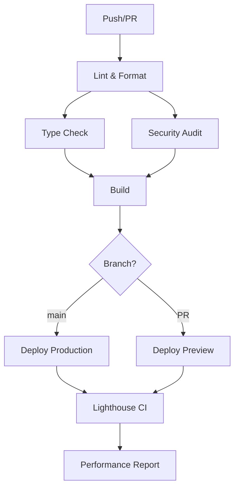

# CI/CD Pipeline Documentation

This document outlines the GitHub Actions CI/CD pipeline configuration for the DSA Tracker project.

## 🚀 Workflows Overview

### 1. Main CI/CD Pipeline (`ci-cd.yml`)

**Triggers:**

- Push to `main` and `develop` branches
- Pull requests to `main` and `develop` branches

**Jobs:**

1. **Code Quality Check (`lint`)**

   - Runs ESLint
   - Checks Prettier formatting
   - Ensures code style consistency

2. **TypeScript Type Check (`typecheck`)**

   - Validates TypeScript types
   - Catches type errors early

3. **Build Application (`build`)**

   - Builds the Next.js application
   - Runs only after lint and typecheck pass
   - Creates build artifacts for deployment

4. **Security Audit (`security`)**

   - Runs npm audit for vulnerabilities
   - Uses audit-ci for stricter security checks

5. **Deploy to Production (`deploy-production`)**

   - Deploys to Vercel production environment
   - Runs only on `main` branch pushes
   - Comments deployment URL on commit

6. **Deploy Preview (`deploy-preview`)**

   - Creates preview deployments for PRs
   - Comments preview URL on PR

7. **Dependency Check (`dependency-check`)**
   - Checks for outdated packages
   - Runs on schedule or manual trigger

### 2. Auto Format (`auto-format.yml`)

**Triggers:**

- Pull request opened or synchronized

**Purpose:**

- Automatically formats code using Prettier
- Commits formatted code back to the PR branch
- Ensures consistent code formatting

### 3. Dependency Updates (`dependency-updates.yml`)

**Triggers:**

- Weekly schedule (Mondays at 9:00 AM UTC)
- Manual trigger

**Purpose:**

- Updates dependencies to latest compatible versions
- Applies security fixes
- Creates automated PR with changes

### 4. Lighthouse CI (`lighthouse.yml`)

**Triggers:**

- Push to `main` branch
- Pull requests to `main` branch

**Purpose:**

- Runs performance audits
- Checks accessibility compliance
- Monitors web vitals and SEO metrics

## 🔧 Required Secrets

Configure these secrets in your GitHub repository settings:

### Vercel Deployment

```
VERCEL_TOKEN           # Vercel API token
VERCEL_ORG_ID         # Vercel organization ID
VERCEL_PROJECT_ID     # Vercel project ID
```

### Firebase Configuration

```
NEXT_PUBLIC_FIREBASE_API_KEY
NEXT_PUBLIC_FIREBASE_AUTH_DOMAIN
NEXT_PUBLIC_FIREBASE_PROJECT_ID
NEXT_PUBLIC_FIREBASE_STORAGE_BUCKET
NEXT_PUBLIC_FIREBASE_MESSAGING_SENDER_ID
NEXT_PUBLIC_FIREBASE_APP_ID
NEXT_PUBLIC_FIREBASE_MEASUREMENT_ID
```

### AI Service Keys

```
OPENAI_API_KEY        # OpenAI API key
CLAUDE_API_KEY        # Claude API key
```

### Optional

```
LHCI_GITHUB_APP_TOKEN # Lighthouse CI GitHub App token
```

## 📊 Performance Monitoring

### Lighthouse CI Configuration

- Performance threshold: 80%
- Accessibility threshold: 90%
- Best practices threshold: 80%
- SEO threshold: 80%

### Monitored Pages

- Homepage (`/`)
- Login page (`/login`)
- Profile page (`/profile`)

## 🛠️ Local Development Tasks

The VS Code tasks are configured in `.vscode/tasks.json`:

### Available Tasks

- **Dev Server**: Start development server
- **Build**: Build production bundle
- **Lint**: Run ESLint
- **Lint Fix**: Auto-fix ESLint issues
- **Format Code**: Format with Prettier
- **Check Formatting**: Verify formatting
- **Type Check**: Run TypeScript compiler
- **Install Dependencies**: Install npm packages
- **Clean Install**: Clean install dependencies
- **Security Audit**: Run security audit
- **Update Dependencies**: Update packages

### Running Tasks

1. Open Command Palette (`Ctrl+Shift+P` / `Cmd+Shift+P`)
2. Type "Tasks: Run Task"
3. Select desired task

## 🔍 Quality Gates

### Pre-merge Checks

- ✅ Code formatting (Prettier)
- ✅ Linting (ESLint)
- ✅ Type checking (TypeScript)
- ✅ Security audit
- ✅ Successful build
- ✅ Performance audit (Lighthouse)

### Automated Actions

- 🤖 Auto-format code on PR
- 🤖 Weekly dependency updates
- 🤖 Security vulnerability alerts
- 🤖 Performance regression detection

## 📝 Contributing

### Pull Request Process

1. Create feature branch from `develop`
2. Make your changes
3. Push to your branch
4. Create pull request to `develop`
5. CI/CD pipeline runs automatically
6. Review and merge after all checks pass

### Code Style

- Follow existing code patterns
- Use TypeScript for type safety
- Follow component documentation standards
- Write descriptive commit messages

## 🚨 Troubleshooting

### Common Issues

**Build Failures:**

- Check TypeScript errors
- Verify all imports are correct
- Ensure environment variables are set

**Deployment Issues:**

- Verify Vercel secrets are configured
- Check build logs for errors
- Ensure all dependencies are installed

**Lint Failures:**

- Run `npm run lint:fix` locally
- Check for unused imports
- Verify code formatting with Prettier

### Getting Help

- Check GitHub Actions logs
- Review error messages in PR checks
- Consult the main README.md for setup instructions

## 🔄 Pipeline Flow



---

For more details, see individual workflow files in `.github/workflows/`.
